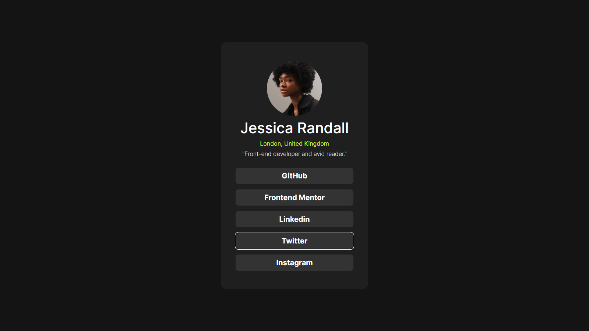

- [Overview](#overview)
  - [The challenge](#the-challenge)
  - [Screenshot](#screenshot)
  - [Links](#links)
- [My process](#my-process)
  - [Built with](#built-with)
  - [What I learned](#what-i-learned)
  - [Continued development](#continued-development)
  - [Useful resources](#useful-resources)
- [Author](#author)
- [Acknowledgments](#acknowledgments)

**Note: Delete this note and update the table of contents based on what sections you keep.**

## Overview

### The challenge

Users should be able to:

- See hover and focus states for all interactive elements on the page

### Screenshot

### Links

- Solution URL: [Add solution URL here](https://your-solution-url.com)
- Live Site URL: [Add live site URL here](https://your-live-site-url.com)

## My process

### Built with

- Semantic HTML5 markup
- CSS custom properties
- Flexbox
- CSS Grid
- Mobile-first workflow

### What I learned

I learned the basics of responsive design.

### Useful resources

- [frontend mentor](https://frontendmentor.io/) - This site is the best place to practice css and complete challenges.

## Author

- Website - [GrowWithTalha](https://growwithtalha.vercel.app)
- Frontend Mentor - [@Grow-with-Talha](https://www.frontendmentor.io/profile/Grow-with-Talha)
- Twitter - [@GrowWithTalha](https://twitter.com/GrowWithTalha)
- Linkedin - [@growwithtalha1](https://www.linkedin.com/in/growwithtalha1/)
